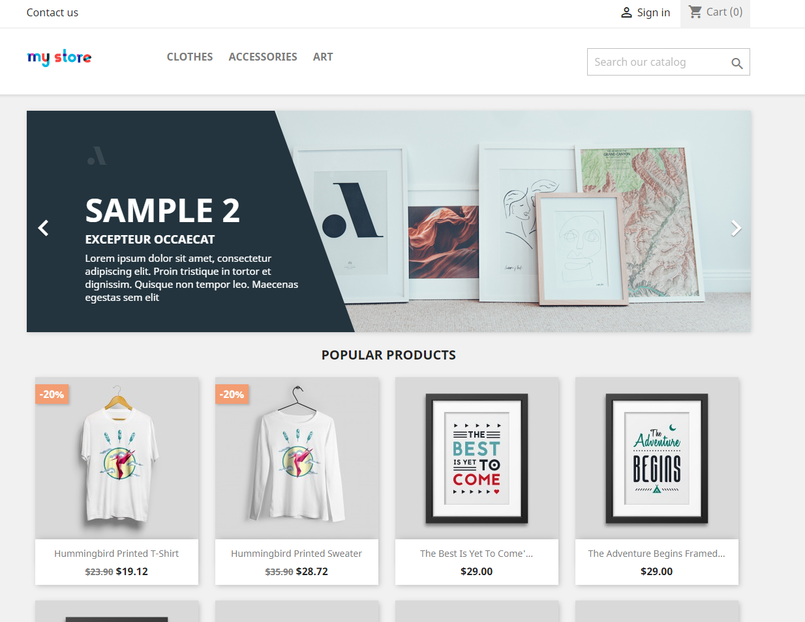

<h1>My Store Automation Tests</h1>
<h3>Projeto de Automação de Testes utilizando o site My Store. Buscando usar as ferramentas mais atuais e boas práticas</h3>

## Neste projeto foi implementado:
- Testes e2e com Cypress.
- Cenários de testes com Cucumber.
- Uso do padrão Page Objects.
- Uso de Mapa de Elementos.

### **Pré Requisitos**:
Para executar o projeto de testes em seu computador, é necessário ter instalado: 

- [git](https://git-scm.com/) (utilizei a v2.38.1.windows.1);
- [Node.js](https://nodejs.org/en/) (utilizei a v18.13.0);
- [npm](https://www.npmjs.com/) (utilizei a v9.1.1);

> É recomendado a utilização das mesmas versões ou mais recentes.
> Para verificar as versões do git, Node.js e npm instaladas, execute o comando `git --version && node --version && npm --version`;

### **Instalação**:
Execute o comando **npm install** para instalar as dependências do projeto.

### **Comandos para execução de testes**:

>Execute este comando para abrir o Cypress em modo Interativo;
~~~
npm run
~~~

>Execute este comando para abrir o Cypress em modo Headless;
~~~
npm open
~~~
